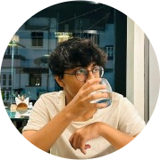

### About me

Hi, I'm Abdullah Khan. I'm currently a final year student (Bachelor of Computer Applications).

I've written a variety of programs as a hobbyist developer since back when I was in middle and high school in Python and React, spanning multiple areas like web-apps, CLI tools, GUI tools and automation scripts. I'm continuing to work towards persuing my passion of software development as my career, now as a CS student. Right now, I primarily enjoy exploring new technologies and learning them.

### Languages

### Technologies

### Other skills

### Stats

